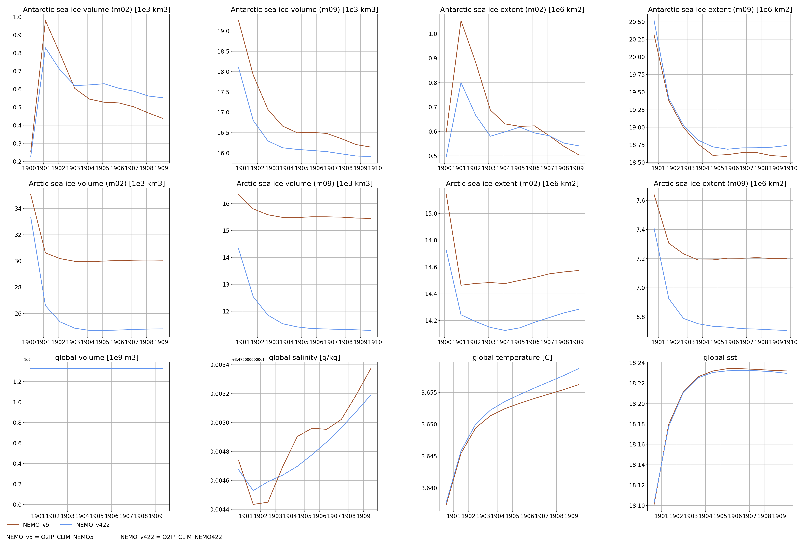

Assumption
==========
- You already have all your scalar data you want to plot as time series ready somewhere in netcdf format. Here we will not discuss how to compute or output directly via xios the variables you want
- Conda is avalaible on your computer (much easier to set up the correct environement). You can create it via the yml file. If your HPC do not have http connection, you need to pack it, copye it on your HPC and un-pack it (see https://conda.github.io/conda-pack/ for detailed explanation on conda pack)
- image magic (`convert`) to set up the various plots in a specific way.

Data location
=============
Data directory tree is very simple. Let's say you want to compare 2 simulations called `NEMO_v422` and `NEMO_v50`. 
In this case, you simply need to dump all the netcdf that contain the scalar or time series you want to plot in 2 different repo call `NEMO_v422` and `NEMO_v50` each in a master directory of your choice.
This directory can be anywhere on your computer.

```
DATA ----- NEMO_v422
       |
        --- NEMO_v5
```

Setup
=====
- 1: create your python environement using the file `valso.yml` using conda (`conda env create -f valso.yml` or using [conda pack](https://conda.github.io/conda-pack/))
- 2: activate your python environement: `conda activate valso` (or `source /path_to_valso_python_env/valso/bin/activate` if you used conda pack)
- 3: setup your line definitions for python in `style.db`

```
(valso) [my_prompt]$ cat style.db 
 runid                   |     name      |   line   |   color        |
 O2IP_CLIM_NEMO5         | NEMO_v5       |   -      | sienna         |
 O2IP_CLIM_NEMO422       | NEMO_v422     |   -      | cornflowerblue |
```
   * `runid` is the simulation name
   * `name` meaningfull name for the plot legend
   * `line` and `color` the style used for the plot

Plotting tool
=============
The main script is `run_plot_NEMO.bash`. Its usage is fairly simple:
```
(valso) [NEMO_VALIDATION]$ ./run_plot_NEMO.bash
need a [DIR] [KEYWORD] (will be inserted inside the output name) and a list of id [RUNIDS RUNID ...] (definition of line style need to be done in RUNID.db)
```
So to compare 2 simulations (O2IP_CLIM_NEMO5 O2IP_CLIM_NEMO422):
```
./run_plot_NEMO.bash /path_to_data/DATA NEMO O2IP_CLIM_NEMO5 O2IP_CLIM_NEMO422
```

The plotting script is based on the python script:
```
python ${PATH_SCRIPT}/plot_time_series.py -noshow -runid <list of runids> -f <input files list (wild card accepted like *toto*.nc)> -var <variable name> -sf <scale factor> -title "title [unit]" -dir <master directory (DATA)> -o <tmp figure name (fig01)
```
One call of this script do one plot.

Once all the plot are build a page is build using image magic:

```
# trim figure
for file in fig??.png ; do
    convert $file -crop 1240x1040+0+0 tmp${file#fig}
done

convert legend.png     -trim -bordercolor White -border 20 tmp10.png
convert runidname.png  -trim -bordercolor White -border 20 tmp11.png

# compose the image
convert \( tmp01.png tmp02.png tmp03.png tmp04.png +append \) \
        \( tmp05.png tmp06.png tmp07.png tmp08.png +append \) \
        \( tmp20.png tmp21.png tmp22.png tmp23.png +append \) \
           tmp10.png tmp11.png -append -trim -bordercolor White -border 40 $KEY.png
```

So you can edit easily the script to match your need as long as the data are already available as scalar or time series with a record dimension to concatenate the data (time series out of XIOS already have the correct format).

Data example:
```
netcdf O2L3P_LONG_NEMO4.2.2_1y_19000101_19091231_monitoring_oce_1904-1904 {
dimensions:
	...
	time_dimension = UNLIMITED ; // (1 currently)
variables:
	double time_coordinate(time_counter) ;
		...
	float bgtemper(time_counter) ;
		bgtemper:coordinates = "time_coordinate" ;
		...
```

Output
======


